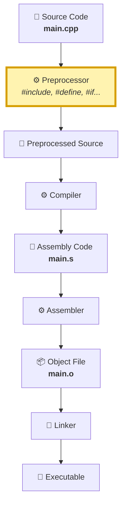
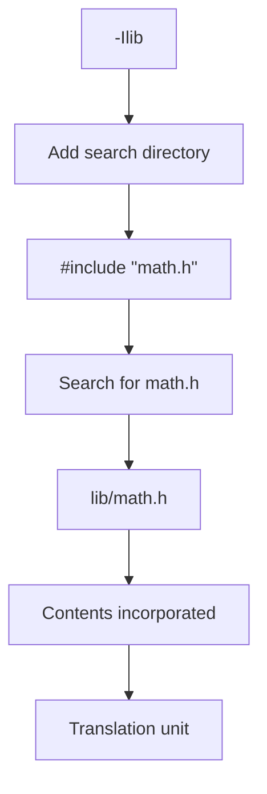
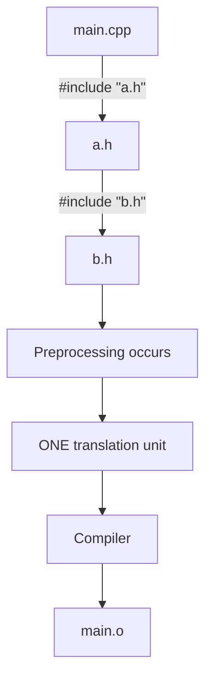
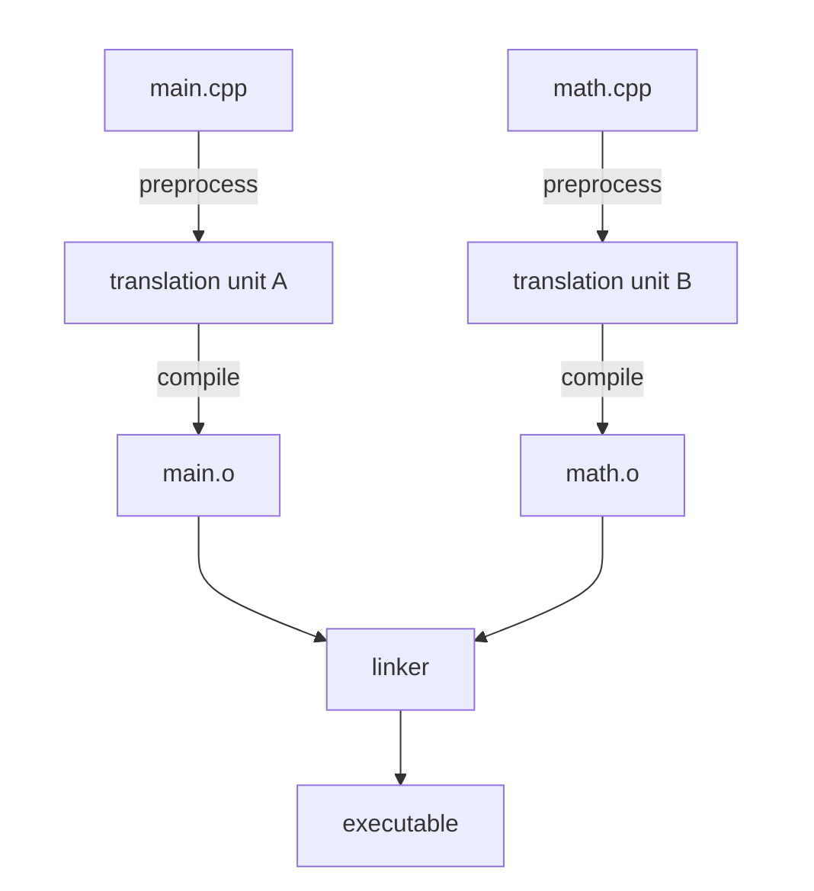
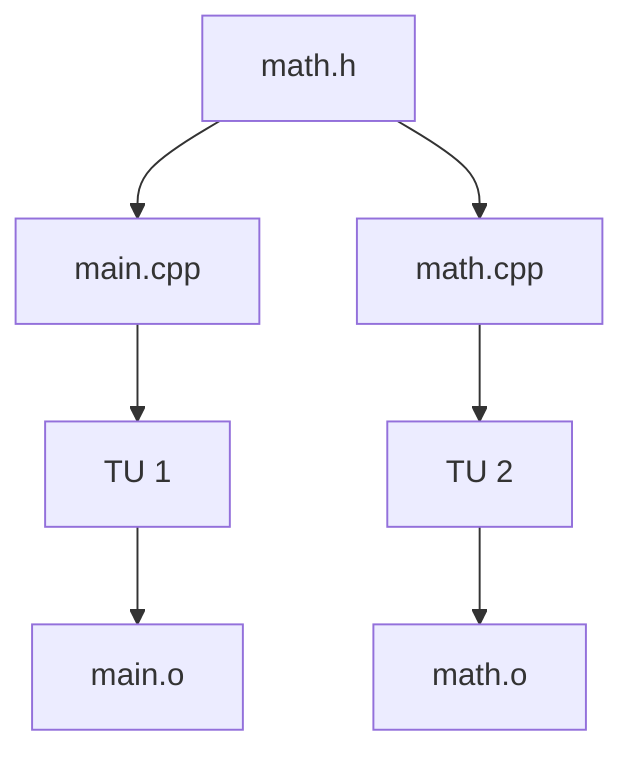
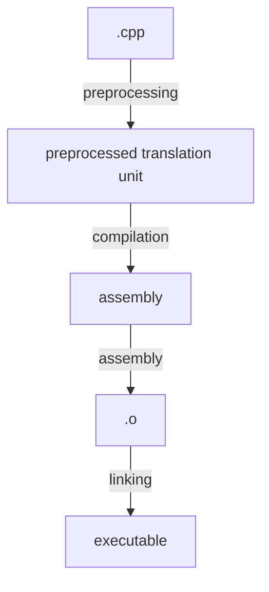

# 1. Where the preprocessor fits... 
For a simplified C/C++ build pipeline:  

The critical thing is:  
  
the compiler proper doesn't compile your original `.cpp`file    exactly as you wrote it. It compiles the result of    preprocessing it.   

# 2. Simplest Possible Program...
Suppose we have... 
```c
#define NUMBER 42

int main()
{
    int x = NUMBER;
}
```
We save this as main.cpp(as seen in ../examples).  
  
Normally, we'd do... 
```Bash
g++ main.cpp
```
and GCC quietly performs all the necessary stages... but, we can tell GCC, 'Preprocess this file and then stop', with...  
```Bash
g++ -E main.cpp
``` 
```text
-E       Preprocess only; do not compile, assemble or link.  
```
You'll get quite a bit of output, so it's easier to redirect it:
```Bash
g++ -E main.cpp > main.i
```
the Output will be... 
```text
# 0 "main.cpp"
# 0 "<built-in>"
# 0 "<command-line>"
# 1 "/usr/include/stdc-predef.h" 1 3 4
# 0 "<command-line>" 2
# 1 "main.cpp"


int main()
{
    int x = 42;
}
```
Notice what's gone:
```C++
#define NUMBER 42
```
And what's changed:
```C++
int x = NUMBER;
```
became:
```C++
int x = 42;
```  
That's because `#define` is a preprocessor directive  

the C++ compiler never needs to understand `NUMBER` as a C++ variable. The prepocessor dealt with it first. 

# 3. Thats what the `#` is telling you
Consider things you've probably seen a million times... 
```C++ 
#include <iostream>

#define SIZE 100

#ifdef DEBUG
#endif

#if 0 
#endif

#pragma once
```
These aren't ordinary C++ statements. They're **preprocessing dirctives**.  
  
That leading `#` is essentially saying:
```text
"This instruction is for the preprocessing phase."
```
So there's an important conceptual seperation... 
```text
Preprocessor language               C++ language
------------------------------------------------------
```
```C++
#include<iostream>                  
                                    int x = 10;

#define SIZE 100                    
                                    std::cout<<x;

#ifdef DEBUG                        
                                    class Window{};

#endif                              
                                    void foo();
```
They're intermingled in the same source file, which makes them look like one language. But conceptually they're being handled at different stages. 

# 4. `#include` is particularly important... 
Let's create this:
```text 
project/
├── main.cpp
└── math.h
```
`math.h`:
```C++
int add(int a, int b);
```
`main.cpp`:
```C++
#include "math.h"

int main()
{
    return add(2, 3);
}
```
At a conceptual level, when the preprocessor encounters:
```C++
#include "math.h"
```
It finds that file and incorporates its contents into the preprocessing translation process.  
  
So you can roughly imagine:
```C++
#include "math.h"

int main()
{
    return add(2, 3);
}
```
This is why people commonly describe `#include` as copy-and-paste.  
  
That's not a complete description of the formal preprocessing rules, but it's an excellent initial mental model.  
  
And notice something important:  
  
`math.h` isn't separately linked into `main.cpp`.  
  
Its contents participate in producing the translation unit that gets compiled.  
  
# 5. This explains `-I`
This connects directly to something that I've encountered with CMake.  
  
Suppose we have:
```text
project/
├── app/
│   └── main.cpp
│
└── lib/
    ├── math.cpp
    └── math.h
```
and `main.cpp` contains:
```C++
#include "math.h"
```
You might complile with:
```Bash
g++ -Ilib -c app/main.cpp -o main.o
```
We've previously asked the very good question:
  
> "Why is it `-Ilib` instead of `-Ilib/math.h`?"
  
Now we can put it precisely.  
  
`-I` doesn't tell the compiler:

> Include this file. 

It tells the preprocessing/header-search machinery:  
  
> **Add this directory to the places you search when resolving  `#include` directives**  
  
So... 
```Bash
-Ilib
```
adds:
```text
project/lib/
```
to the header search path.  
  
Then:
```C++
#include "math.h"
```
requests the file.  
  
Conceptually:

This is the underlying mechanism that CMake's:
```cmake
target_include_directories(...)
```
is eventually helping configure.  
  
# 6. Headers aren't compiled by `#include`
This wording is worth getting right.  
  
Suppose:
```C++
#include "math.h"
```
The preprocessor doesn't compile `math.h` and then hand some compiled header object to `main.cpp`.  
  
Instead, preprocessing produces **one translation unit** from the source file and all the material brought in through preprocessing.  
  
Starting with:
```text
main.cpp
```
which contains:
```C++
#include "a.h"
```
and maybe `a.h` contains:
```C++
#include "b.h"
```
you can conceptually picture;

That one translation unit -> one object file relationship is one of the most useful mental in traditional C/C++ compilation.  
  
# 7. Each `.cpp` goes through this independently
Now suppose:
```text
main.cpp
math.cpp
math.h
```
Both source files contain:
```C++
#include "math.h"
```
You don't get one giant preprocessing operation for the entire program.  
  
Instead, think:  

`math.h` can therefore participate in both translation units.  
  
Conceptually:

This fact is going to explain a ton of C++ behavior later:
- header guards
- `#pragma once`
- declarations versus definitions
- `inline`
- templates
- the One Definition Rule(ODR)
- duplicate symbols
- `static`
- `extern`
- separate compilation  
  
They're not a collection of unrelated weird C++ rules. Many arise naturally from the **translation-unit compilation model**.  
  
# 8. Conditional compilation happens here too... 
For example:
```C++
#define DEBUG

#ifdef DEBUG
    void print_debug();
#endif
```
The preprocessor evaluates:
```C++ 
#ifdef DEBUG
```
and determines whether that material should remain.  
  
If `DEBUG` is defined, the resulting source contains:
```C++
void print_debug();
```
If it isn't defined, that declaration isn't present there after preprocessing.  
  
This also explains compiler options such as:
```Bash
g++ -DDEBUG main.cpp
```
`-DDEBUG` effectively gives the preprocessing environment a macro definition for `DEBUG`.  
  
So this:
```Bash
g++ -DDEBUG main.cpp
```
allows:
```C++
#ifdef DEBUG

// included

#endif
```
to succeed without writing:
```C++
#define DEBUG
```
in the source  
  
And once again there's a CMake connection:  
```cmake
target_compile_definitions(my_target PRIVATE DEBUG)
```
At the machine underneath CMake, that can ultimately result in compiler-driver arguments corresponding to something like:
```Bash
-DDEBUG
```
Now `target_compile_definitions()` doesn't seem quite so arbitrary.  
  
  
---  
# 9. There's a subtle terminology issue
I've been using the convenient phrase preprocessed source, but the standard's formal compilation model is somewhat more detailed than:
```text
preprocessor -> compiler -> assembler -> linker
```
C and C++ specify phases of translation, including character processing, line splicing, tokenization, preprocessing directives and macro expansion, adjacent string literal handling, translation, and linking.  
  
Actual implementations like GCC and Clang don't have internally mirror our simple boxes exactly.  
  
For learning the practical compilation model, though:

is a very useful model.  
  
We'll refine it where necessary rather than making the first unnecessarily abstract.  
  
# The experiment we'll do first... 
Before going any further, let's actually look at preprocessing happen.  
  
## numbers.h
```C++ 
#define FAVORITE_NUMBER 42
```
## main.cpp
```C++
#include "number.h"

int main()
{
    int number = FAVORITE_NUMBER;
    return number;
}
```
Then:
```Bash
g++ -E main.cpp > build/main.i
```
and inspect:
```Bash
less build/main.i
```
You will eventually find:
```C++
... 
using std::tgamma;
using std::trunc;
# 2 "main.cpp" 2


# 3 "main.cpp"
int main()
{
    int number = FAVORITE_NUMBER;
    return number;
}
```
That tiny experiment establishes foundational facts simultaneously:
```text
#include    -> brings another file's contents into preprocessing  

#define     -> macro replacement occurs  
  
g++ -E      -> lets us inspect the result
```
There is a lot more worth dissecting inside the preprocessor itself - especially exactly how #include searches for files,
"header.h" versus <header.h>, macro expansion rules, header guards, predifined macros, and conditional compilation, Those are worth understanding. before we leave the preprocessor stage. 